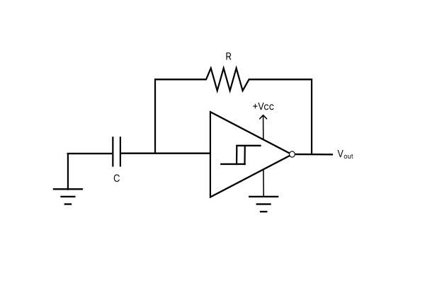
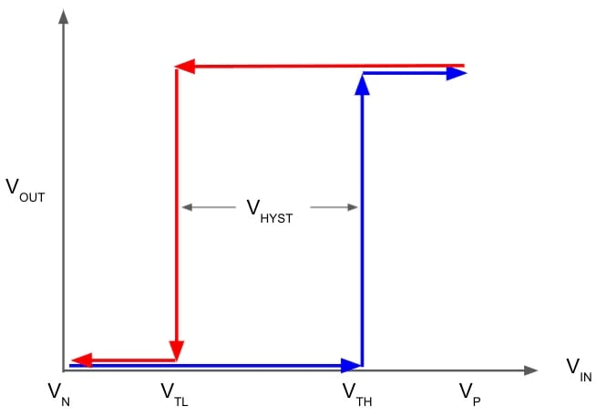

## Why CMOS?

| Approach | Challenges |
|---|---|
| VO₂ oscillators | Device variability, fabrication complexity |
| RRAM / memristors | Forming, endurance, sneak paths |
| Analog op-amp oscillators | Higher power and component count |
| CMOS Schmitt-trigger oscillators | Standard process compatible, scalable, low power |

### Advantages of CMOS

- Compatible with standard CMOS fabrication flows
- Can be integrated with digital control logic
- Lower static power consumption
- Scales well with node count
- Suitable for future ASIC implementation

---

### Schmitt trigger (IC 7414) used for Hysteresis

  
  &nbsp;&nbsp;&nbsp;
  

  <b>Fig. 1.</b> Schmitt Trigger Oscillator Circuit
  &nbsp;&nbsp;&nbsp;&nbsp;&nbsp;&nbsp;&nbsp;&nbsp;&nbsp;&nbsp;&nbsp;&nbsp;&nbsp;&nbsp;&nbsp;&nbsp;&nbsp;&nbsp;&nbsp;&nbsp;&nbsp;&nbsp;
  <b>Fig. 2.</b> Hysteresis

### Breadboard Implementation

#### NOT Gate (2 Node)

