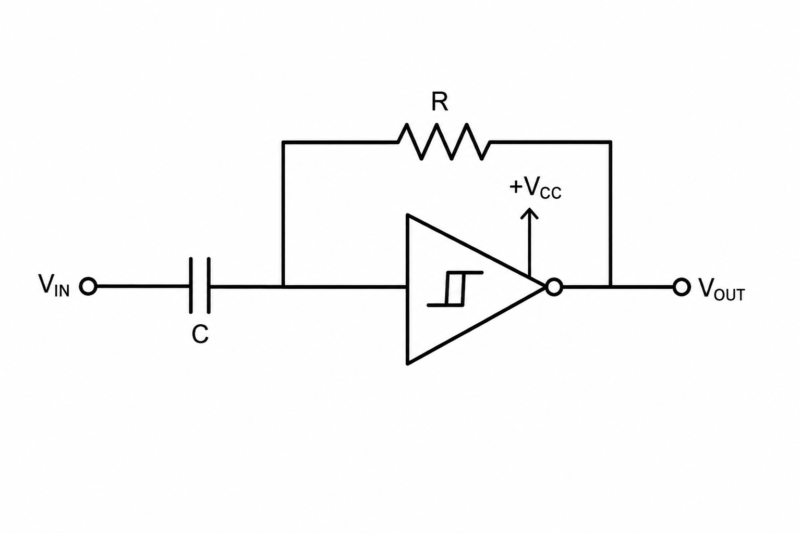
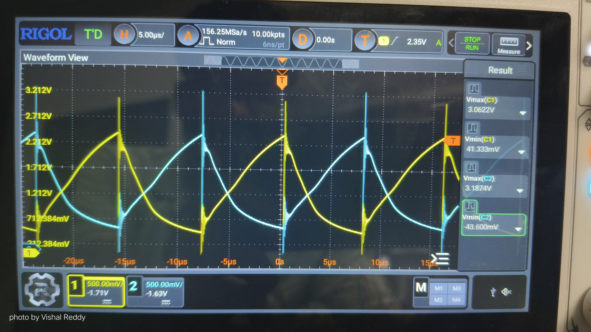
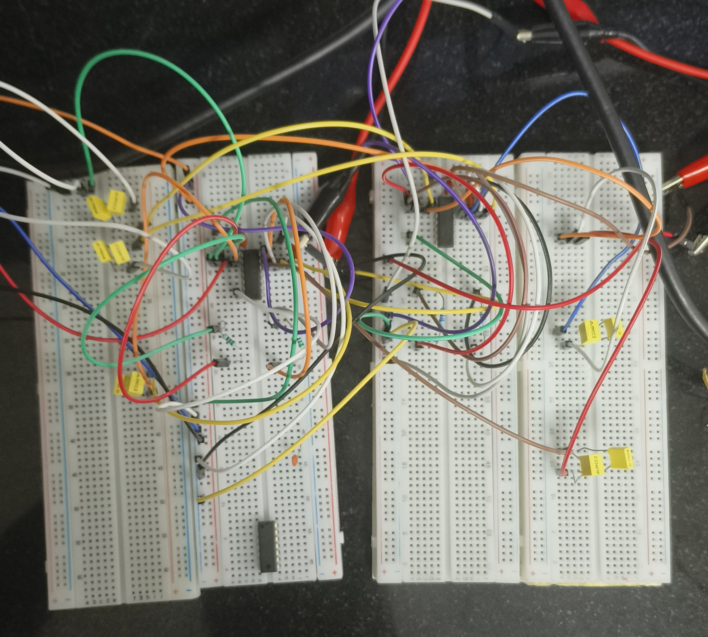
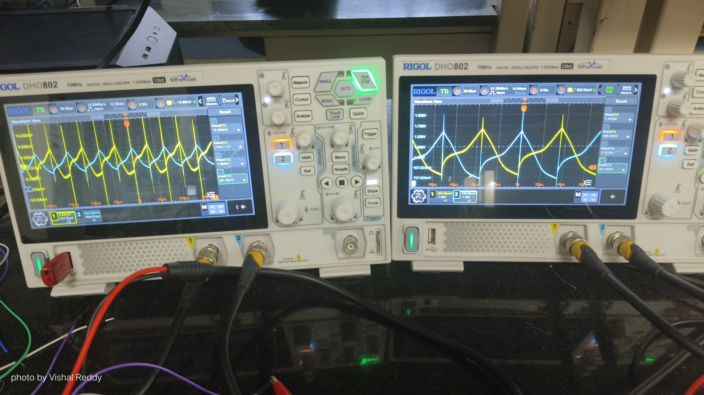
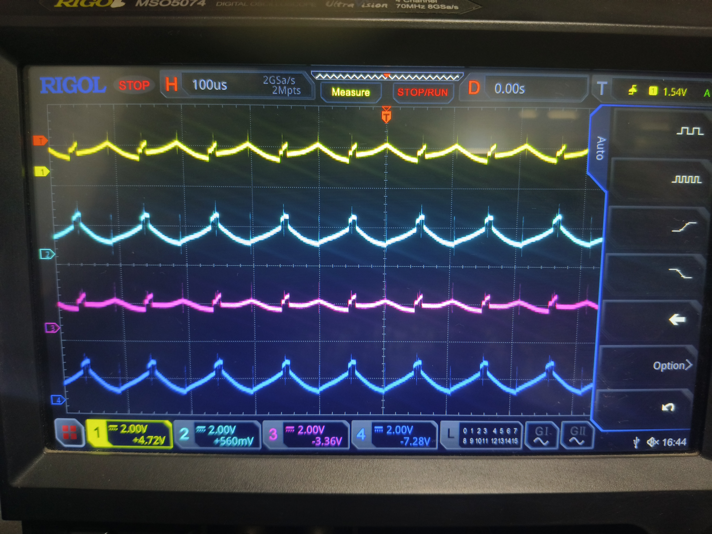
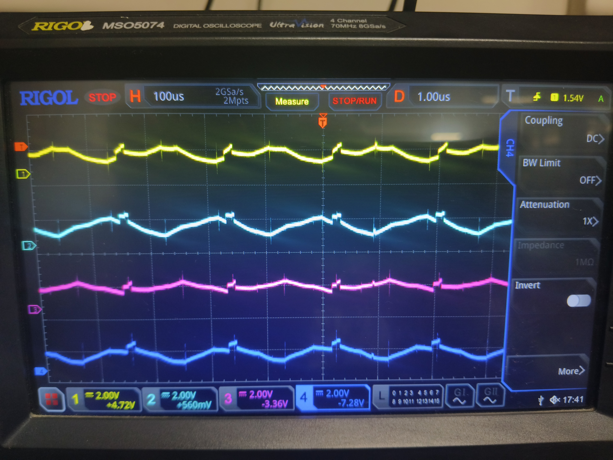
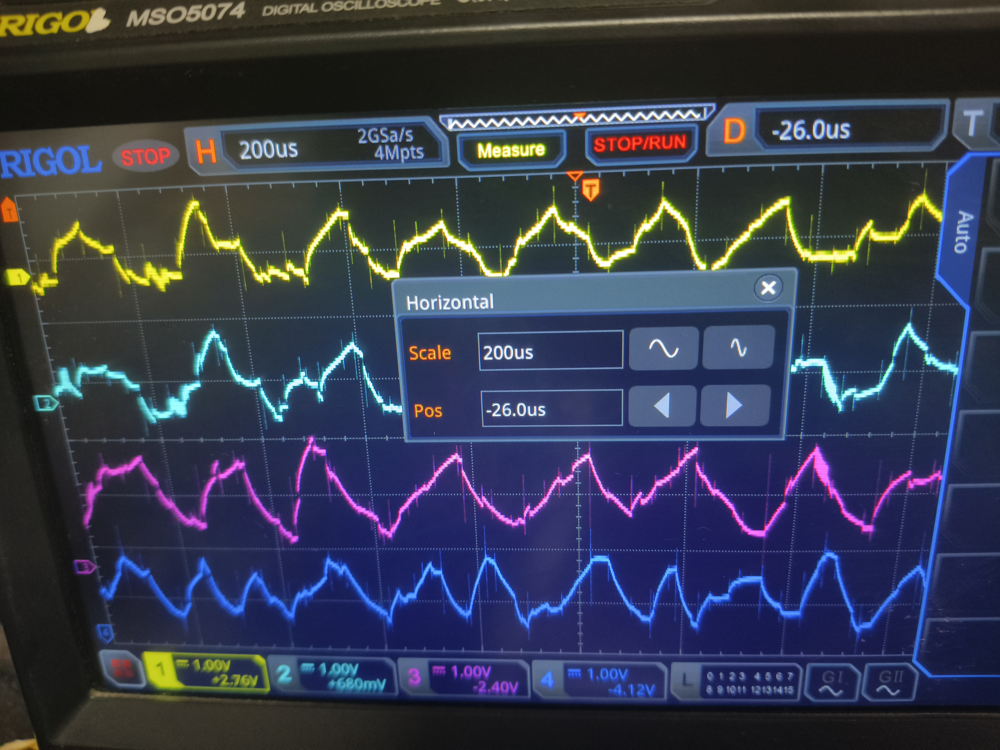
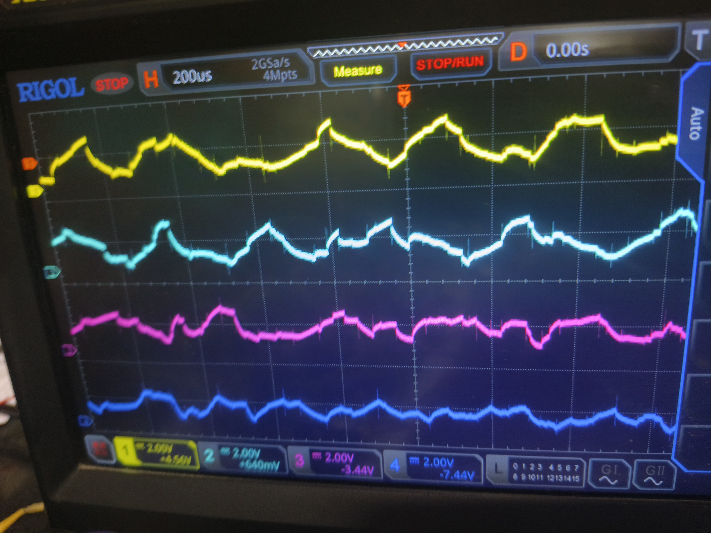

## Why CMOS?

| Approach | Challenges |
|---|---|
| VO₂ oscillators | Device variability, fabrication complexity |
| RRAM / memristors | Forming, endurance, sneak paths |
| Analog op-amp oscillators | Higher power and component count |
| CMOS Schmitt-trigger oscillators | Standard process compatible, scalable, low power |

### Advantages of CMOS

- Compatible with standard CMOS fabrication flows
- Can be integrated with digital control logic
- Lower static power consumption
- Scales well with node count
- Suitable for future ASIC implementation

---

### Schmitt trigger (IC 7414) used for Hysteresis

  
  &nbsp;&nbsp;&nbsp;
  

  <b>Fig. 1.</b> Schmitt Trigger Oscillator Circuit
  &nbsp;&nbsp;&nbsp;&nbsp;&nbsp;&nbsp;&nbsp;&nbsp;&nbsp;&nbsp;&nbsp;&nbsp;&nbsp;&nbsp;&nbsp;&nbsp;&nbsp;&nbsp;&nbsp;&nbsp;&nbsp;&nbsp;
  <b>Fig. 2.</b> Hysteresis

---

### Breadboard Implementation

#### - NOT Gate (2 Node)

  

  <b>Fig. 1.</b> 2 node coupled with a capacitor acting like a NOT gate

#### - 2x2 (4 Node)

  
  &nbsp;&nbsp;&nbsp;
  

  <b>Fig. 1.</b> 4 Node Maxcut Circuit on Breadboard
  &nbsp;&nbsp;&nbsp;&nbsp;&nbsp;&nbsp;&nbsp;&nbsp;&nbsp;&nbsp;&nbsp;&nbsp;&nbsp;&nbsp;&nbsp;&nbsp;&nbsp;&nbsp;&nbsp;&nbsp;&nbsp;&nbsp;
  <b>Fig. 2.</b> Output waveforms for the four nodes on Oscilloscope.

#### - 3x2 (6 Node)

  
  &nbsp;&nbsp;&nbsp;
  

  <b>Fig. 1.</b> 6 Node Maxcut Circuit on Breadboard
  &nbsp;&nbsp;&nbsp;&nbsp;&nbsp;&nbsp;&nbsp;&nbsp;&nbsp;&nbsp;&nbsp;&nbsp;&nbsp;&nbsp;&nbsp;&nbsp;&nbsp;&nbsp;&nbsp;&nbsp;&nbsp;&nbsp;
  <b>Fig. 2.</b> Output waveforms for the six nodes on Oscilloscope.

#### - 4x2 (8 Node)

<table>
  <tr>
    <td align="center">
       
      <b>Fig. 1.</b> 
      Circuit on Breadboard
    </td>
    <td align="center">
       
      <b>Fig. 2.</b> 
      Output waveforms of four of the eight nodes
    </td>
    <td align="center">
       
      <b>Fig. 3.</b> 
      Output waveforms of the other four nodes
    </td>
  </tr>
</table>

#### - 4x4 (16 Node)

<table>
  <tr>
    <td align="center">
       
      <b>Fig. 1.</b> 
      Circuit on Breadboard
    </td>
    <td align="center">
       
      <b>Fig. 2.</b> 
      Output waveforms of four of the sixteen nodes
    </td>
    <td align="center">
       
      <b>Fig. 3.</b> 
      Output waveforms of the other four nodes
    </td>
  </tr>
</table>

Due to the limit of no. of outputs that can be seen on the oscilloscope, we acutally saw the results by changing the outputs with all the sixteen different nodes and saw only 4 at a time, However the results are as expected for the problem.

Also a lot of voltage fluctuations have been seen on this 16 node breadboard implementation because of the increased jumper wire path, parasitics of the breadboard and other complications.

Next moving to the PCB design of the circuits.

---

### PCB Design on KiCad

All 2, 4, 6, 9 node implementations have been made on a single PCB layout as seen below.

<table>
  <tr>
    <td align="center" width="50%">
        
      <b>Fig. 1.</b> 2, 4, 6 and 9-Node Schematic
    </td>
    <td align="center" width="50%">
        
      <b>Fig. 2.</b> Corresponding Layout
    </td>
  </tr>
</table>

16 node implementation's schematic and layout is as seen below.

<table>
  <tr>
    <td align="center" width="50%">
        
      <b>Fig. 1.</b> 16 Node Schematic
    </td>
    <td align="center" width="50%">
        
      <b>Fig. 2.</b> Corresponding Layout
    </td>
  </tr>
</table>

3D Views of the fabricated PCBs are as seen below.

<table>
  <tr>
    <td align="center" width="50%">
        
      <b>Fig. 1.</b> 2, 4, 6 and 9-Node PCB 3D view
    </td>
    <td align="center" width="50%">
        
      <b>Fig. 2.</b> 16 Node PCB 3D view
    </td>
  </tr>
</table>

## Future Work

The current work focuses on the design and simulation of oscillator-based neuromorphic circuits. The next phase of the project includes:

- Fabrication and assembly of the designed PCBs.
- Experimental validation and characterization of the oscillator networks.
- Performance evaluation of synchronization-based logic and optimization circuits.
- Migration of the validated designs toward **ASIC tapeout**, enabling on-chip fabrication and evaluation of oscillator-based neuromorphic hardware.
