# VO₂-Based Oscillator Simulations

This work focuses on the development and simulation of VO₂-based coupled oscillator networks for solving Max-Cut optimization problems. Cadence simulations were performed to study oscillator dynamics, synchronization behavior, and phase evolution under different graph topologies.

---

## Workflow

The development began with the behavioral modeling of the fabricated VO₂ switching device using **Verilog-A**. The complete model was implemented in Cadence Virtuoso and is included in this repository. Multiple simulations were carried out to reproduce the experimentally observed switching characteristics and self-sustained oscillations of the fabricated device.

A comprehensive parameter sweep was then performed to determine suitable oscillator component values. Through several transient simulations, the oscillator was tuned to obtain stable and repeatable oscillations. The optimum component values were found to be **900 Ω** for the load resistance and **25 nF** for the load capacitance, which were subsequently used throughout the remaining simulations.

Using the generated coupling parameters, coupled VO₂ oscillator networks were constructed in Cadence for various Max-Cut problems. The oscillator networks were simulated to observe synchronization behavior, phase evolution, and convergence toward steady-state solutions. The final phase relationships between oscillators were then interpreted to obtain the corresponding Max-Cut partitions of the input graphs.

The complete workflow established an integrated pipeline starting from VO₂ behavioral modeling, parameter optimization, and computational graph generation to circuit-level Cadence simulations for oscillator-based Max-Cut optimization.

---

## Cadence Simulations

The following simulations are included in this directory:

- Single VO₂ Oscillator
- Two-Node Max-Cut (NOT gate)
- Three-Node Max-Cut
- Four-Node Max-Cut
- Eight-Node Max-cut

### IV Curve of the VO2 Device that has been modelled.  
##

<table align="center">
  <tr>
    <td align="center">
      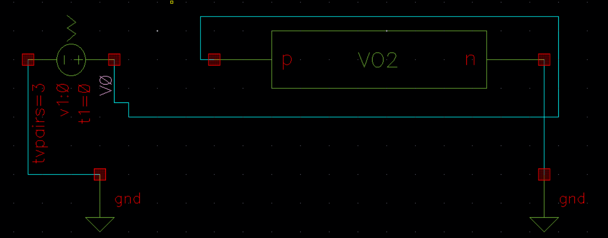 
      <b>Figure 1: VO2 Device under IV analysis</b>
    </td>
    <td align="center">
      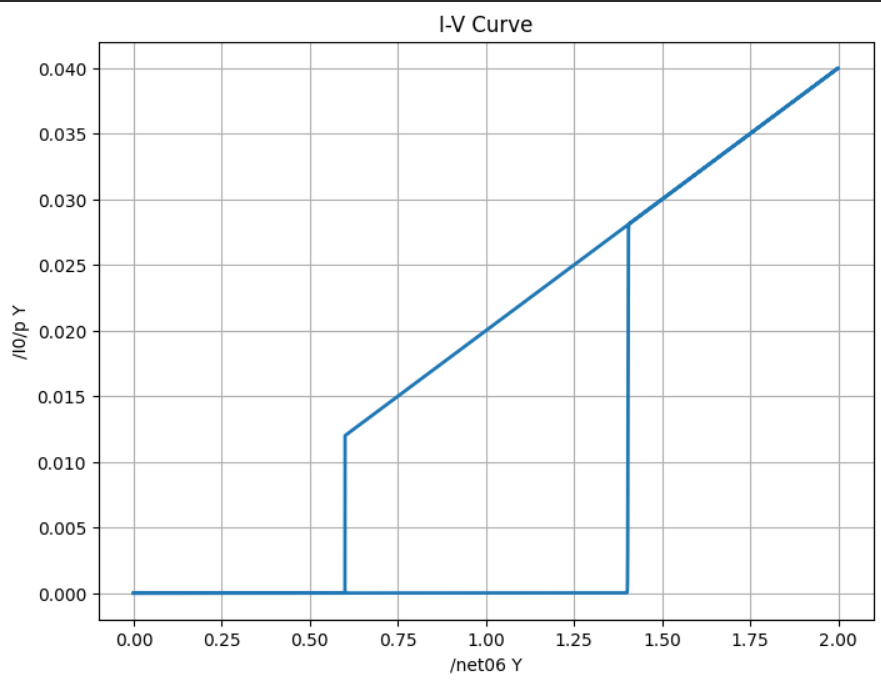 
      <b>Figure 2: Hysteresis from the extracted CSV</b>
    </td>
  </tr>
</table>

### VO2 Oscillator 
##

VO2 Oscillator has been made by adding an appropriate RC network with VO2 for obtaining sustained oscillations as seen below.
<table align="center">
  <tr>
    <td align="center">
      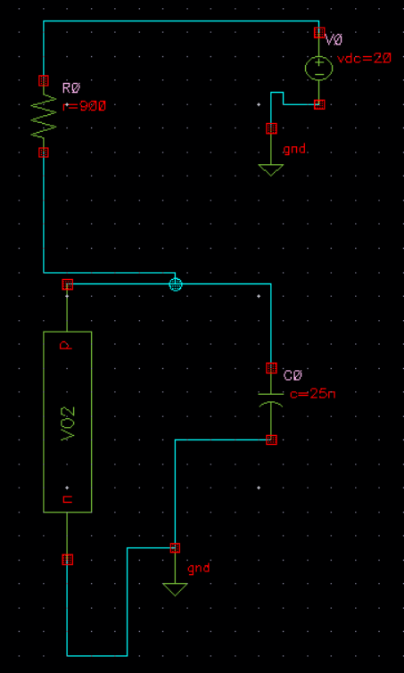 
      <b>Figure 1: VO2 based oscillator</b>
    </td>
    <td align="center">
      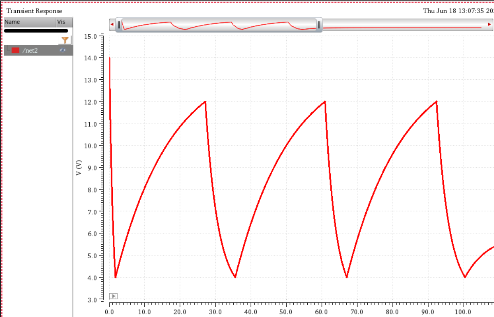 
      <b>Figure 2: Oscillations from the simulation</b>
    </td>
  </tr>
</table>

### NOT gate (2 Node)
##
Two VO2 based oscillators have been coupled with a large enough capacitor to get a 180 deg phase shift which gives a NOT gate like result.
<table align="center">
  <tr>
    <td align="center">
      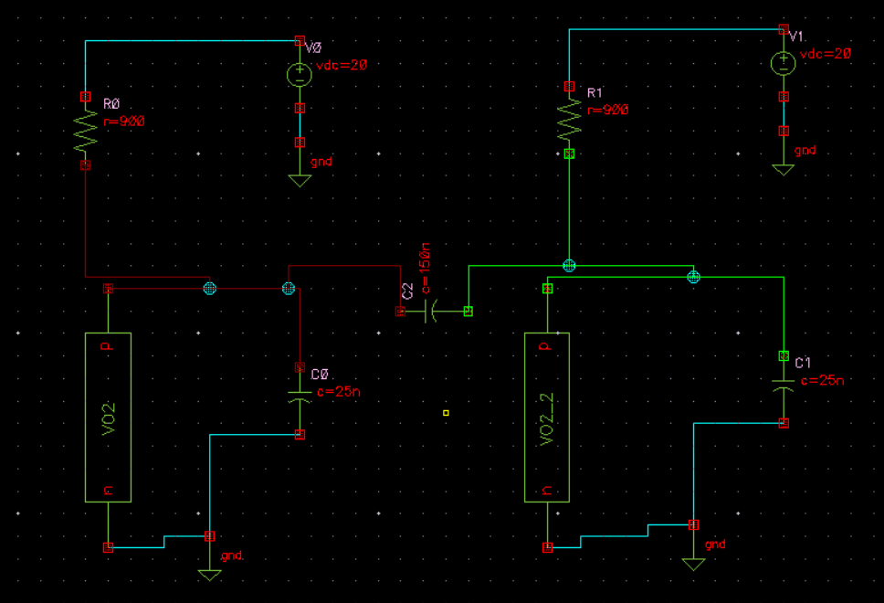 
      <b>Figure 1: 2 Node network</b>
    </td>
    <td align="center">
      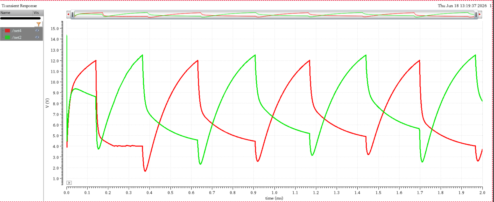 
      <b>Figure 2: Oscillations from the simulation</b>
    </td>
  </tr>
</table>

### 4 Node Network 
##
Four VO2 based oscillators have been placed with couplings as seen from the maxcut problem below and the results are as expected as seen from the simulations.
<table align="center">
  <tr>
    <td align="center">
      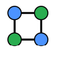 
      <b>Figure 1: Maxcut problem</b>
    </td>
    <td align="center">
      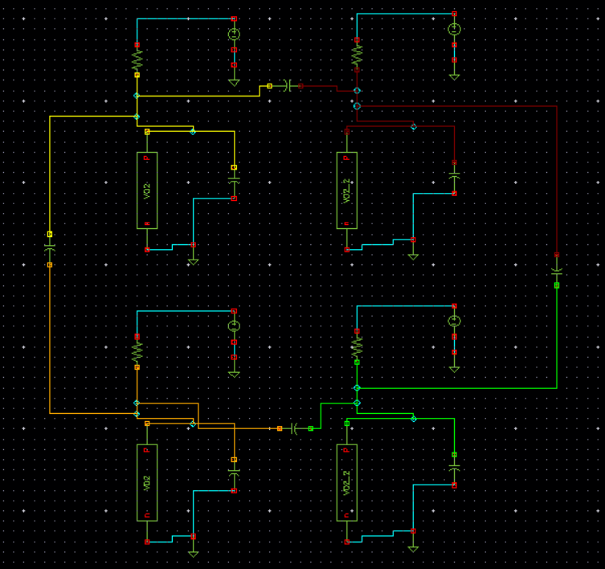 
      <b>Figure 2: The circuit of the same</b>
    </td>
    <td align="center">
      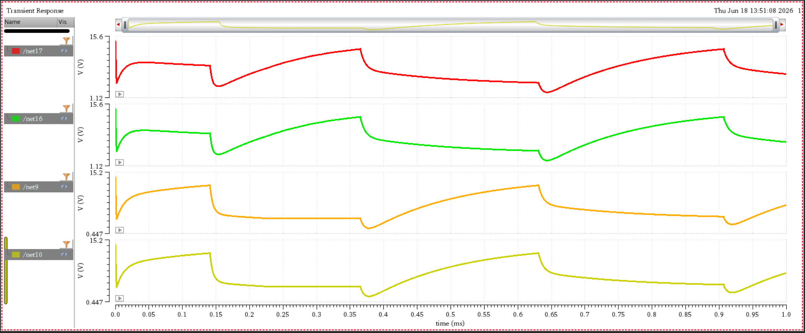 
      <b>Figure 3: Simulation of the circuit</b>
    </td>
  </tr>
</table>

### 6 Node Network
##

Six VO2 based oscillators have been placed with couplings as seen from the maxcut problem below and the results are as expected as seen from the simulations.

<table align="center">
  <tr>
    <td align="center">
      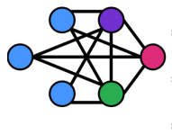 
      <b>Figure 1: Maxcut problem</b>
    </td>
    <td align="center">
      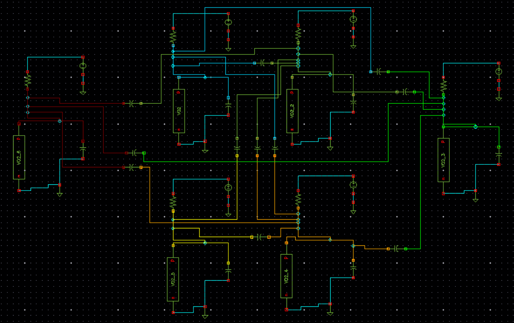 
      <b>Figure 2: The circuit of the same</b>
    </td>
  </tr>
  <tr>
    <td align="center">
      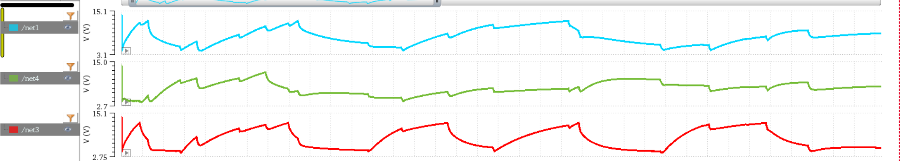 
      <b>Figure 3: Simulation 1</b>
    </td>
    <td align="center">
      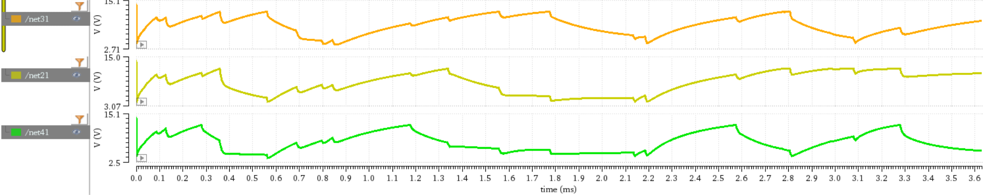 
      <b>Figure 4: Simulation 2</b>
    </td>
  </tr>
</table>

### 8 Node Network
##

Eight VO2 based oscillators have been placed with couplings as seen from the maxcut problem below and the results are as expected as seen from the simulations.

<table align="center">
  <tr>
    <td align="center">
      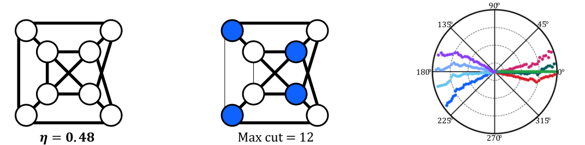 
      <b>Figure 1: Maxcut problem</b>
    </td>
    <td align="center">
      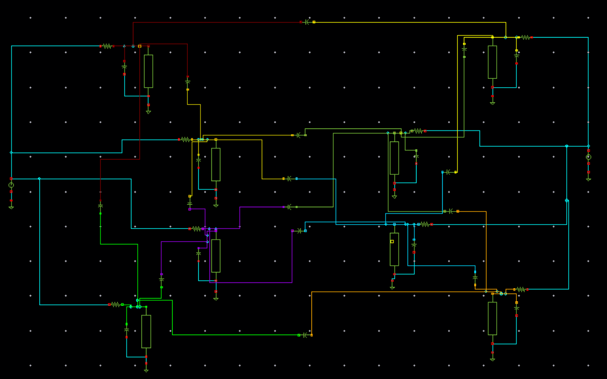 
      <b>Figure 2: The circuit of the same</b>
    </td>
  </tr>
  <tr>
    <td align="center">
      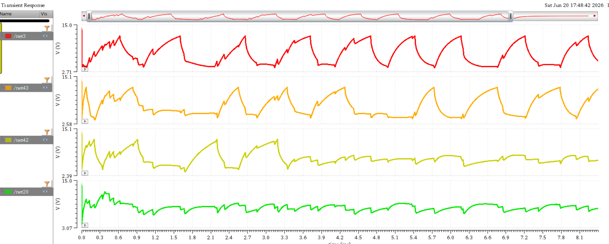 
      <b>Figure 3: Simulation 1</b>
    </td>
    <td align="center">
      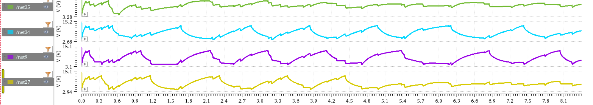 
      <b>Figure 4: Simulation 2</b>
    </td>
  </tr>
</table>

## Future Improvements

- Spice-level modeling with realistic parasitic effects
- Experimental validation using fabricated VO₂ devices
- Larger coupled oscillator networks
- Hardware implementation on custom PCBs

